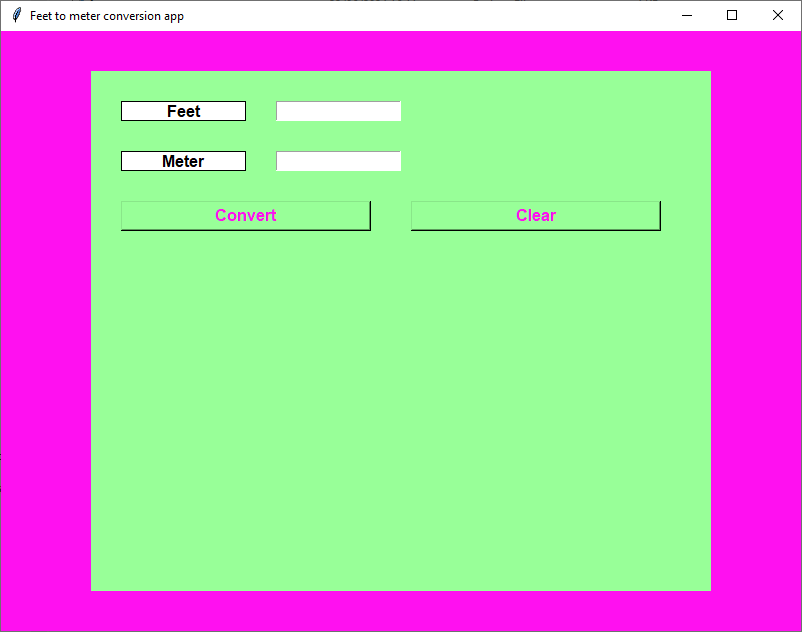

<h1>FMCONVERTER</h1>

<h2>What is FMCONVERTER</h2>

FMCONVERTER is a Feet to Meter and Meter to Feet, python converter.

<h2>How to use</h2>

There are three versions of the desktop app (Windows).

<ul>
  <li><b>fmconverter.pyw</b>: You can double click it and the app should popup without background cli screen.</li>
  <li><b>fmconverter.py</b>: If you double click this version, the app should popup with a background cli screen.</li>
  <li><b>build</b> folder: You'll find inside it a version that is in the executable format. It has the background cli screen.</li>
</ul>

Once you've chosen wich one you want to use, the GUI is straight forward.

You have the FEET label and next to it, the FEET box where you can enter a number. It has basic security so it will give you an error if you try to enter something other than a number.

In the same fashion, under FEET, you have the METER label and the METER box next to it. You can enter a number here to.

To convert a number, chose the box of the number (FEET or METER), and click the button CONVERT. It will give you the result in the cell you left blank.

The CLEAR button is used to clear all cells once you are done with your conversion.

 
<h2>Snapshot of the app</h2>

 

Thanks for reading this file.

<i>Keith Parum</i>

